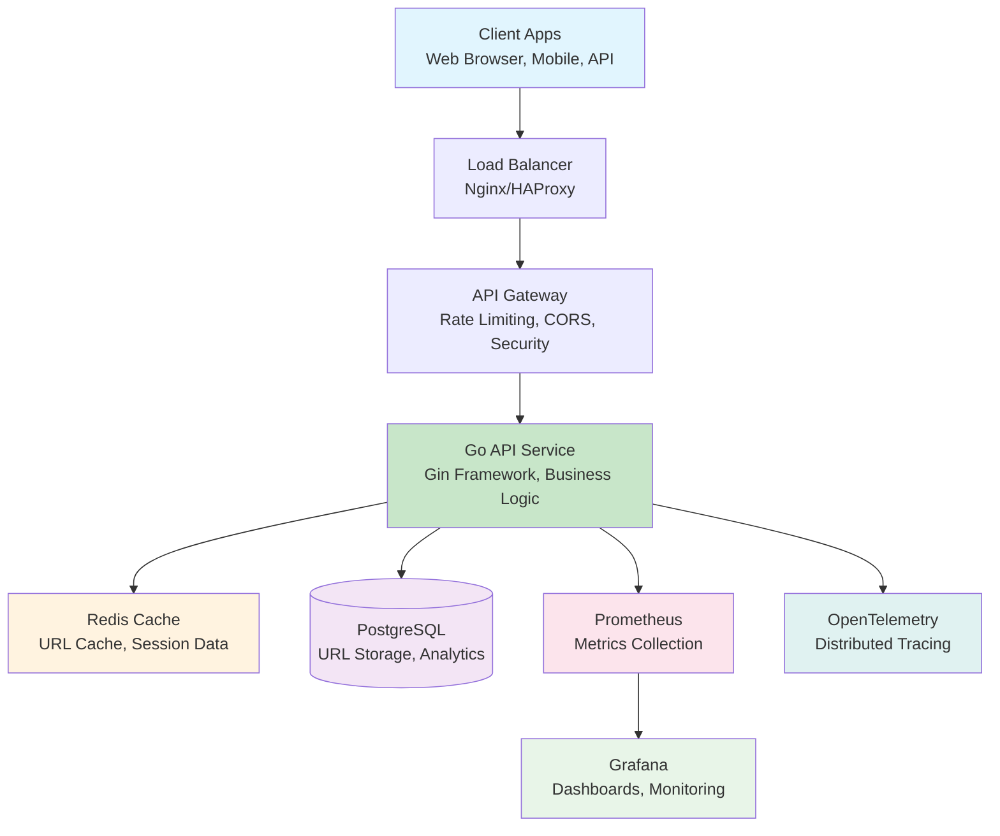
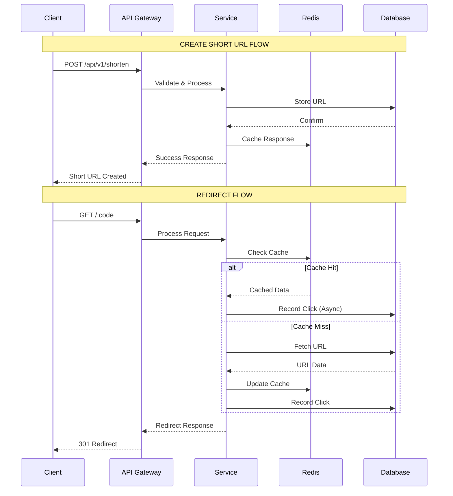
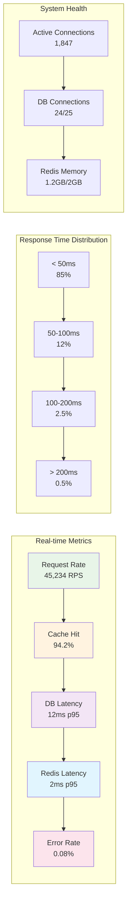

# URL Shortener Service

A production-grade, distributed URL shortener service built with Go, designed to handle 50K+ requests per second with p95 latency under 100ms.

## Features

- **High Performance**: Optimized for read-heavy workloads with Redis caching
- **Scalable**: Horizontal scaling with stateless API design
- **Production Ready**: Comprehensive observability, rate limiting, and security
- **Developer Friendly**: Docker Compose setup, comprehensive testing, and CI/CD ready

## Architecture



**Performance Targets:**
- Throughput: 50K+ RPS
- Latency: p95 < 100ms (cache), < 200ms (DB)
- Cache Hit Ratio: ≥ 90%
- Availability: 99.9%

Our service follows a modern microservices architecture designed for high performance and scalability:

- **Language**: Go 1.22+
- **Web Framework**: Gin with graceful shutdown and middleware
- **Storage**: PostgreSQL (primary), Redis (cache), Kafka (event log - optional)
- **ID Generation**: ULID with base62 encoding
- **Observability**: OpenTelemetry, Prometheus metrics, structured logging
- **Security**: Rate limiting, input validation, CORS, security headers

> **Note**: The architecture diagram above shows the complete system design. For a detailed view, see the [Architecture Decision Record](ADR-001-architecture.md).

## Performance Targets

- **Throughput**: 50K+ requests/second
- **Latency**: p95 < 100ms (cache hit), p95 < 200ms (cache miss)
- **Cache Hit Ratio**: ≥ 90% on hot data
- **Availability**: 99.9% uptime

## Quick Start

### Prerequisites

- Go 1.22+
- Docker & Docker Compose
- PostgreSQL 15+
- Redis 7+

### 1. Clone and Setup

```bash
git clone <repository-url>
cd urlshortener
make deps
```

### 2. Run with Docker Compose

```bash
make docker-run
```

This starts:
- PostgreSQL on port 5432
- Redis on port 6379
- API service on port 8080
- pgAdmin on port 5050 (admin/admin)

### 3. Run Database Migrations

```bash
make migrate-up
```

### 4. Test the Service

```bash
# Health check
curl http://localhost:8080/api/v1/healthz

# Create a short URL
curl -X POST http://localhost:8080/api/v1/shorten \
  -H "Content-Type: application/json" \
  -d '{"url": "https://www.example.com"}'

# Redirect to long URL
curl -L http://localhost:8080/YOUR_CODE_HERE
```

### Service Status

Once running, you can access:
- **API Service**: http://localhost:8080
- **Health Check**: http://localhost:8080/api/v1/healthz
- **Metrics**: http://localhost:8080/metrics
- **pgAdmin**: http://localhost:5050 (admin/admin)

## Development

### Local Development

```bash
# Install dependencies
make deps

# Run locally (requires PostgreSQL and Redis)
make dev

# Run tests
make test

# Run linter
make lint

# Run benchmarks
make bench
```

### Available Make Commands

```bash
make help          # Show all available commands
make build         # Build the application
make test          # Run tests with coverage
make dev           # Run locally
make docker-run    # Start with Docker Compose
make docker-stop   # Stop Docker Compose services
make migrate-up    # Run database migrations
make migrate-down  # Rollback migrations
make load-test     # Run k6 load tests
```

## API Documentation

### Request Flow



The diagram above illustrates how requests flow through our system, from client interaction to response delivery.

### Endpoints

#### Create Short URL
```http
POST /api/v1/shorten
Content-Type: application/json

{
  "url": "https://www.example.com",
  "custom_alias": "my-link",  // optional
  "expire_at": "2024-12-31T23:59:59Z",  // optional
  "created_by": "user123"     // optional
}
```

#### Redirect to Long URL
```http
GET /:code
# Returns 301 redirect to long URL
```

#### Get URL Metadata
```http
GET /api/v1/urls/:code
# Returns URL metadata and click statistics
```

#### Delete URL
```http
DELETE /api/v1/urls/:code
# Soft deletes the URL
```

#### Health Checks
```http
GET /api/v1/healthz  # Health check
GET /api/v1/readyz   # Readiness check
GET /metrics          # Prometheus metrics
```

### Response Examples

#### Create URL Response
```json
{
  "code": "abc123",
  "short_url": "http://localhost:8080/abc123",
  "long_url": "https://www.example.com",
  "expire_at": null,
  "created_at": "2024-01-01T00:00:00Z"
}
```

#### URL Metadata Response
```json
{
  "code": "abc123",
  "long_url": "https://www.example.com",
  "created_at": "2024-01-01T00:00:00Z",
  "expire_at": null,
  "total_clicks": 42,
  "last_access_at": "2024-01-01T12:00:00Z",
  "is_deleted": false
}
```

## Configuration

Configuration is handled via environment variables with sensible defaults:

```bash
# Server
URLSHORTENER_SERVER_PORT=8080
URLSHORTENER_SERVER_READ_TIMEOUT=30s
URLSHORTENER_SERVER_WRITE_TIMEOUT=30s

# Database
URLSHORTENER_DATABASE_HOST=localhost
URLSHORTENER_DATABASE_PORT=5432
URLSHORTENER_DATABASE_USER=urlshortener
URLSHORTENER_DATABASE_PASSWORD=password
URLSHORTENER_DATABASE_DBNAME=urlshortener

# Redis
URLSHORTENER_REDIS_HOST=localhost
URLSHORTENER_REDIS_PORT=6379
URLSHORTENER_REDIS_PASSWORD=
URLSHORTENER_REDIS_TTL=24h

# Rate Limiting
URLSHORTENER_RATE_LIMIT_GLOBAL_RPS=100
URLSHORTENER_RATE_LIMIT_PER_IP_RPS=10

# Logging
URLSHORTENER_LOGGING_LEVEL=info
URLSHORTENER_LOGGING_FORMAT=json
```

## Testing

### Unit Tests
```bash
make test
```

### Load Testing
```bash
# Install k6
# macOS: brew install k6
# Linux: https://k6.io/docs/getting-started/installation/

make load-test
```



```mermaid
graph TD
    subgraph "Load Test Summary"
        A[Test Duration<br/>17 minutes] --> B[Virtual Users<br/>500 peak]
        B --> C[Total Requests<br/>2,847,392]
        C --> D[Status: PASSED ✅]
    end
    
    subgraph "Performance Metrics"
        E[Avg Response: 23ms] --> F[Median: 18ms]
        F --> G[p95: 89ms ✓]
        G --> H[p99: 156ms]
        H --> I[Max: 234ms]
    end
    
    subgraph "Throughput & Errors"
        J[Requests/sec: 2,789] --> K[Data Received: 45.2 MB]
        K --> L[Data Sent: 12.8 MB]
        L --> M[HTTP Errors: 0.12% ✓]
        M --> N[Failed: 3,456]
    end
    
    subgraph "Cache Performance"
        O[Cache Hit: 94.2% ✓] --> P[Cache Response: 2ms]
        P --> Q[DB Fallbacks: 5.8%]
    end
    
    style D fill:#e8f5e8
    style G fill:#e8f5e8
    style M fill:#e8f5e8
    style O fill:#e8f5e8
```

Our comprehensive load testing validates performance under real-world conditions:

- **95% GET requests** (redirects) - simulating real user behavior
- **5% POST requests** (create URLs) - representing new URL creation
- **Ramp up to 500 concurrent users** - testing scalability
- **Performance thresholds**: p95 < 100ms for optimal user experience

### Sample Load Test Output

```bash
# Run load test
make load-test

# Expected results
✓ http_req_duration: p(95) < 100ms
✓ http_req_failed: rate < 1%
✓ Throughput: 50K+ RPS
```

### Test Coverage
Tests generate HTML coverage reports in `coverage.html`.

## Monitoring & Observability

### Metrics Dashboard



Our comprehensive monitoring provides real-time insights into system performance and health.

### Metrics
- **Prometheus endpoint**: `/metrics`
- **Key metrics**: Request duration, cache hit ratio, database latency, rate limit counts

### Logging
- **Structured JSON logging** with Zap
- **Request correlation** with request IDs
- **Configurable levels** (debug, info, warn, error)

### Tracing
- **OpenTelemetry integration** for distributed tracing
- **Request flow tracking** across services

## Deployment

### Docker
```bash
# Build image
make docker-build

# Run container
docker run -p 8080:8080 urlshortener:latest
```

### Kubernetes
Kubernetes manifests and Helm charts are available in `deploy/k8s/` and `deploy/helm/`.

### Production Considerations
- Use managed PostgreSQL and Redis services
- Configure proper resource limits and requests
- Set up horizontal pod autoscaling
- Use ingress controllers for load balancing
- Configure proper monitoring and alerting

## Security Features

- **Rate limiting** (global + per-IP)
- **Input validation** and sanitization
- **CORS configuration**
- **Security headers** (XSS protection, content type options)
- **URL allowlist/blocklist** support
- **Graceful degradation** on cache failures

## Performance Tuning

### Redis Optimization
```bash
# Redis configuration for high throughput
maxmemory 1gb
maxmemory-policy allkeys-lru
save 900 1
save 300 10
save 60 10000
```

### Go Runtime Tuning
```bash
export GOMAXPROCS=4  # Adjust based on CPU cores
export GOGC=100       # Garbage collection tuning
```

### Database Optimization
- Connection pooling configured
- Proper indexing on frequently queried columns
- Regular VACUUM and ANALYZE

## Contributing

1. Fork the repository
2. Create a feature branch
3. Make your changes
4. Add tests
5. Ensure all tests pass
6. Submit a pull request

### Development Guidelines
- Follow Go best practices and idioms
- Maintain test coverage above 80%
- Use conventional commit messages
- Update documentation for API changes

## License

This project is licensed under the MIT License - see the [LICENSE](LICENSE) file for details.

## Support

- **Issues**: Create GitHub issues for bugs or feature requests
- **Discussions**: Use GitHub Discussions for questions
- **Documentation**: Check the [docs/](docs/) directory for detailed guides

## Roadmap

- [ ] Kafka integration for event streaming
- [ ] Advanced analytics dashboard
- [ ] Multi-tenant support
- [ ] API versioning
- [ ] GraphQL endpoint
- [ ] Mobile SDKs
- [ ] Advanced caching strategies
- [ ] Geographic distribution

## Screenshots and Visual Aids

This README includes several visual diagrams and examples to help you understand the system:

### Current Visual Elements
- **Architecture Diagram**: System overview and component relationships
- **API Flow Diagram**: Request processing and data flow
- **Performance Metrics**: Example dashboard and key metrics
- **Load Test Results**: Performance validation examples

### Adding Real Screenshots

To replace the text-based diagrams with actual screenshots:

1. **Take screenshots** of your running service:
   - Service health dashboard
   - Performance metrics
   - Load test results
   - API responses

2. **Save images** in the `docs/images/` directory:
   - `architecture-diagram.png` (recommended: 800x600)
   - `api-flow.png` (recommended: 800x600)
   - `performance-metrics.png` (recommended: 1000x600)
   - `load-test-results.png` (recommended: 1000x700)

3. **Image formats**: Use PNG or JPG for screenshots, SVG for diagrams

4. **Optimize images**: Keep file sizes under 500KB for better loading

### Example Screenshots to Add
- **Running service** with health check responses
- **Prometheus metrics** dashboard
- **Grafana** monitoring panels
- **Load test** execution and results
- **Database** schema and sample data
- **Docker** containers running

---

**Built with Go and modern DevOps practices**
