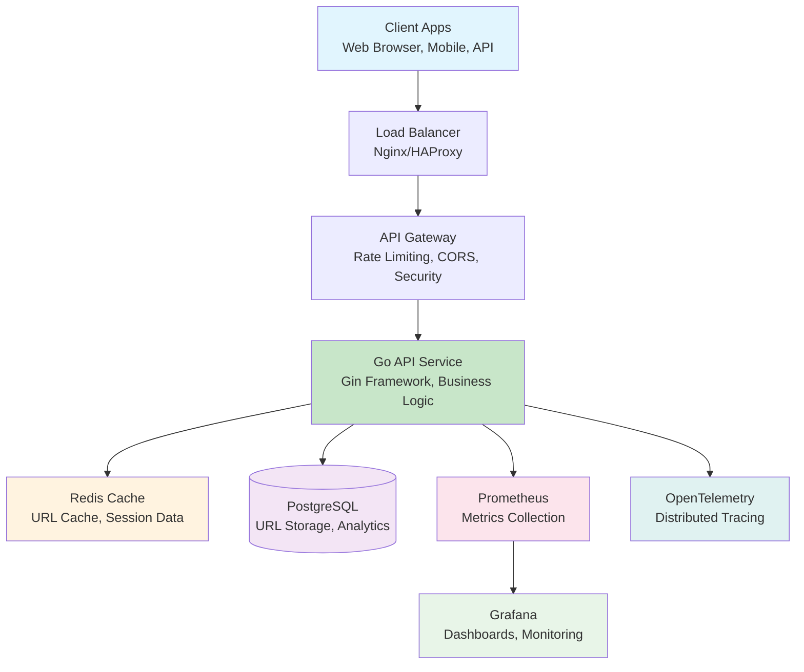

```mermaid
graph TB
    Client[Client Apps<br/>Web Browser, Mobile, API] --> LB[Load Balancer<br/>Nginx/HAProxy]
    LB --> Gateway[API Gateway<br/>Rate Limiting, CORS, Security]
    Gateway --> Service[Go API Service<br/>Gin Framework, Business Logic]
    
    Service --> Redis[Redis Cache<br/>URL Cache, Session Data]
    Service --> DB[(PostgreSQL<br/>URL Storage, Analytics)]
    
    Service --> Metrics[Prometheus<br/>Metrics Collection]
    Metrics --> Grafana[Grafana<br/>Dashboards, Monitoring]
    Service --> Tracing[OpenTelemetry<br/>Distributed Tracing]
    
    style Client fill:#e1f5fe
    style Service fill:#c8e6c9
    style Redis fill:#fff3e0
    style DB fill:#f3e5f5
    style Metrics fill:#fce4ec
    style Grafana fill:#e8f5e8
    style Tracing fill:#e0f2f1
```

**Performance Targets:**
- Throughput: 50K+ RPS
- Latency: p95 < 100ms (cache), < 200ms (DB)
- Cache Hit Ratio: ≥ 90%
- Availability: 99.9%
