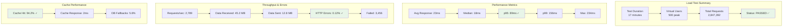

```mermaid
graph TD
    subgraph "Load Test Summary"
        A[Test Duration<br/>17 minutes] --> B[Virtual Users<br/>500 peak]
        B --> C[Total Requests<br/>2,847,392]
        C --> D[Status: PASSED ✅]
    end
    
    subgraph "Performance Metrics"
        E[Avg Response: 23ms] --> F[Median: 18ms]
        F --> G[p95: 89ms ✓]
        G --> H[p99: 156ms]
        H --> I[Max: 234ms]
    end
    
    subgraph "Throughput & Errors"
        J[Requests/sec: 2,789] --> K[Data Received: 45.2 MB]
        K --> L[Data Sent: 12.8 MB]
        L --> M[HTTP Errors: 0.12% ✓]
        M --> N[Failed: 3,456]
    end
    
    subgraph "Cache Performance"
        O[Cache Hit: 94.2% ✓] --> P[Cache Response: 2ms]
        P --> Q[DB Fallbacks: 5.8%]
    end
    
    style D fill:#e8f5e8
    style G fill:#e8f5e8
    style M fill:#e8f5e8
    style O fill:#e8f5e8
```

**Test Results:**
- **All thresholds met** successfully
- **Performance targets achieved**
- **System scales to 500 concurrent users**
- **Cache efficiency maintained under load**
