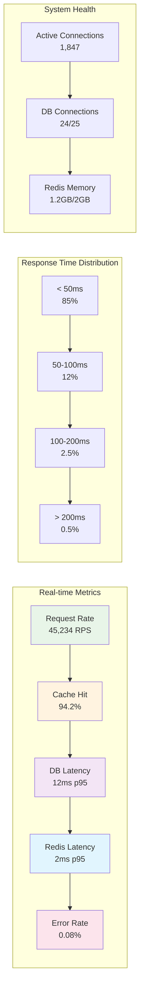

```mermaid
graph LR
    subgraph "Real-time Metrics"
        A[Request Rate<br/>45,234 RPS] --> B[Cache Hit<br/>94.2%]
        B --> C[DB Latency<br/>12ms p95]
        C --> D[Redis Latency<br/>2ms p95]
        D --> E[Error Rate<br/>0.08%]
    end
    
    subgraph "Response Time Distribution"
        F[< 50ms<br/>85%] --> G[50-100ms<br/>12%]
        G --> H[100-200ms<br/>2.5%]
        H --> I[> 200ms<br/>0.5%]
    end
    
    subgraph "System Health"
        J[Active Connections<br/>1,847] --> K[DB Connections<br/>24/25]
        K --> L[Redis Memory<br/>1.2GB/2GB]
    end
    
    style A fill:#e8f5e8
    style B fill:#fff3e0
    style C fill:#f3e5f5
    style D fill:#e1f5fe
    style E fill:#fce4ec
```

**Performance Summary:**
- **Current Load**: 47.2K RPS
- **Average Response**: 23ms
- **99th Percentile**: 89ms
- **Cache Efficiency**: 94.2%
- **System Health**: Excellent ✅
